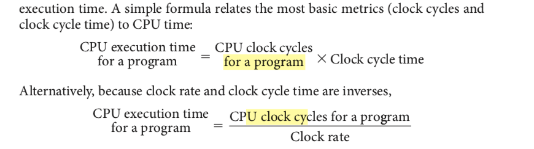
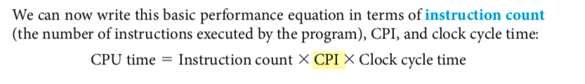
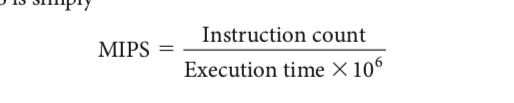

# module 1:

---

### 1.6 (on performance):
> Because performance and execution time are reciprocals, increasing performance requires decreasing execution time.

**How to compute cpu time**:
> Since we are confining ourselves to CPU performance at this point, the bottom-line performance measure is CPU execution time:

**what are cpu clock cycles**

You might be wondering how to calculate clock cycles for a program in the equaion above.

> However, since the compiler clearly generated instructions to execute, and the computer had to execute the instructions to run the program, the execution time must depend on the number of instructions in a program. One way to think about execution time is that it equals the number of instructions executed multiplied by the average time per instruction. Therefore, the number of clock cycles required for a program can be written as

__fleshed out cpu time__

**Other notes**
> Always bear in mind that the only complete and reliable measure of computer performance is time. For example, changing the instruction set to lower the instruction count may lead to an organization with a slower clock cycle time or higher CPI that offsets the improvement in instruction count. Similarly, because CPI depends on type of instructions executed, the code that executes the fewest number of instructions may not be the fastest.

#### Formulas

cpu time = instruction count * cpi * clock cycle time
cpu time = instruction count * cpi / clock rate
cpu clock cycles = instructions for a program * avg clock cycles per instruction
cpi = instruction count / clock cycles
cpi =  cpu time / (instruction count * clock cycle time)
performance of x = 1 / execution time of x

cost per die = cost per wafer / (dies per wafer * yield)

**Outside notes**

> The speed of a computer processor, or CPU, is determined by the clock cycle, which is the amount of time between two pulses of an oscillator. Generally speaking, the higher number of pulses per second, the faster the computer processor will be able to process information. The clock speed is measured in Hz, often either megahertz (MHz) or gigahertz (GHz). For example, a 4 GHz processor performs 4,000,000,000 clock cycles per second.

>In a computer, the clock cycle is the time between two adjacent pulses of the oscillator that sets the tempo of the computer processor. The number of these pulses per second is known as the clock speed, which is generally measured in Mhz (megahertz, or millions of pulses per second) and lately even in Ghz (gigahertz, or billions of pulses per second).
-Also called clock rate, the speed at which a microprocessor executes instructions. Every computer contains an internal clock that regulates the rate at which instructions are executed and synchronizes all the various computer components. The CPU requires a fixed number of clock ticks (or clock cycles) to execute each instruction. The faster the clock, the more instructions the CPU can execute per second.
-clock cycles are the intervals, not the time. the clock period is the time and clock rate, also a measurement of time, is in gigahertz.

#### Definitions

- elapsed time/response time:  These terms mean the total time to complete a task, including disk accesses, memory accesses, input/output (I/O) activities, operating system overhead—everything.
- CPU execution time: CPU execution time or simply CPU time, which recognizes this distinction, is the time the CPU spends computing for this task and does not include time spent waiting for I/O or running other programs. the time over which the processor is working on our behalf.
- user CPU time: CPU time can be further divided into the CPU time spent in the program, called user CPU time
- system CPU time: and the CPU time spent in the operating system performing tasks on behalf of the program, called
- clock cycle: These discrete time intervals that determine when events take place in the hardware.   
- clock period: the time for a complete clock cycle
- clock rate: the inverse of the clock period
- machine language: To distinguish it from assembly language, we call the numeric version of instructions machine language and a sequence of such instructions machine code. look at page 15.
- compiler: A program that translates high-level language statements into assembly language statements.
- assembler:  from symbolic notation to binary. The first of these programs was named an assembler.
- machine language: the binary language that the machine understands is the machine language.
- performance: We will use the phrase “X is n times faster than Y”— or equivalently “X is n times as fast as Y”— to mean:
PerformanceX/PerformanceY = n. pg 31.
- yield = defined as the percentage of good dies from the total number of dies on the wafer.

### 1.10 (fallacies)

Alternative to time:

> One alternative to time is MIPS (million instructions per second).

