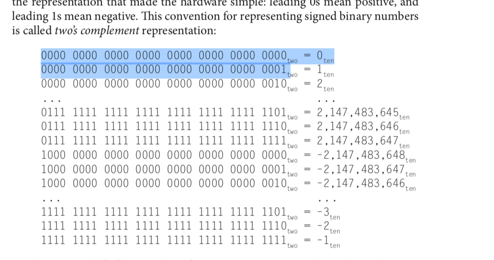

# module 2:

---

## 2.1-2.3 (operands of computer hardware):

#### Notes

when subtracting, easiest thing to do is to add a negative number. Using two's complement, negate and add is the easiest way.

Floating point numbers... the number to the left of the binary point (decimal point) is always a 1 so we don't need to store it.

#### Additional Notes**
> A very large number of registers may increase the clock cycle time simply because it takes electronic signals longer when they must travel farther.
Guidelines such as “smaller is faster” are not absolutes; 31 registers may not be faster than 32. Yet, the truth behind such observations causes computer designers to take them seriously. In this case, the designer must balance the craving of programs for more registers with the designer’s desire to keep the clock cycle fast.

register names:
> Although we could simply write instructions using numbers for registers, from 0 to 31, the MIPS convention is to use two-character names following a dollar sign to represent a register. Section 2.8 will explain the reasons behind these names. For now, we will use $s0, $s1, . . . for registers that correspond to variables in C and Java programs and $t0, $t1, . . . for temporary registers needed to compile the program into MIPS instructions.

where are arrays kept:
> The processor can keep only a small amount of data in registers, but computer memory contains billions of data elements. Hence, data structures (arrays and structures) are kept in memory.

#### Formulas

#### Outside notes

#### Definitions
- compiler: The translation from C to MIPS assembly language instructions is performed by the compiler.
- registers: Unlike programs in high-level languages, the operands of arithmetic instructions are restricted; they must be from a limited number of special locations built directly in hardware called registers. Registers are primitives used in hardware design that are also visible to the programmer when the computer is completed, so you can think of registers as the bricks of computer construction. The size of a register in the MIPS architecture is 32 bits; groups of 32 bits occur so frequently that they are given the name word...One major difference between the variables of a programming language and registers is the limited number of registers, typically 32 on current computers,
- operand: an operand is a term used to describe any object that is capable of being manipulated. For example, in "1 + 2" the "1" and "2" are the operands and the plus symbol is the operator.
- data transfer instructions: arithmetic operations occur only on registers in MIPS instructions; thus, MIPS must include instructions that transfer data between memory and registers. Such instructions are called data transfer instructions.
- memory: To access a word in memory, the instruction must supply the memory address. Memory is just a large, single-dimensional array, with the address acting as the index to that array, starting at 0.
- address: A value used to delineate the location of a specific data element within a memory array.
- word: The natural unit of access in a computer, usually a group of 32 bits; corresponds to the size of a register in the MIPS architecture.

---

## 2.4 (sign and unsigned numbers)

## 1.6 (on performance):

#### Notes
> Numbers are kept in computer hardware as a series of high and low electronic signals, and so they are considered base 2 numbers

Two's complement:
- leading 0s mean positive, and leading 1s mean negative
- Two’s complement representation has the advantage that all negative numbers have a 1 in the most significant bit.
- Two’s complement does have one negative number, -2,147,483,648ten, that has no corresponding positive number.

cool:
> Generalizing the point, in any number base, the value of ith digit d is d * Base^i ... where i starts at 0 and increases from right to left.

That makes sense. in base 2, 0010, that 1 is 1 * 2^1 where i = 1.

Inverting twos complement:
> The first shortcut is a quick way to negate a two’s complement binary number. Simply invert every 0 to 1 and every 1 to 0, then add one to the result.

#### Additional Notes**

> Speaking broadly, an ISA is a medium whereby a processor communicates with the human programmer (although there are several other formally identified layers in between the processor and the programmer). A

To quickly get the binary of a decimal:

100

write out the powers of 2

____ ___    ____   _____   _____   _____   ____
1     1       0      0       1       0       0

start with the largest power (the 64 on the very left) and put a 1 there. subtract 64 from 100 and you're left with 36. Take the next biggest power (32) and put a 1 there. Subtract 32 from 36 and you're left with a 4. PUt 0s in the slots in between 4 and 32 and put a 1 in 4. You're done.

#### LEcture notes
-
What is an ISA?
Since we only have 0s and 1st, the hardware tells the software how to interpret these 0s and 1s. The CPU can understand certain things... but and the CPU can say it supports an add or a jump or a NOR or a addi, .. the ISA is the set of instructions that the CPU can understand. If you give the CPU an instruction you can't understand, it can't process it.

#### Formulas

best way to do bit substraction is to convert binary to decimal, so the subtraction, then convert back.

 01101001
-00101010

Easiest way is to first convert to decimal.

Best way to add:
- convert decimal to binary. Look at pg 204.

#### Outside notes
Signed vs unsigned numbers:
> Signed numbers use sign flag or can be distinguish between negative values and positive values. Whereas unsigned numbers stored only positive numbers but not negative numbers....Unsigned binary numbers do not have sign bit, whereas signed binary numbers uses signed bit as well or these can be distinguishable between positive and negative numbers
> Signed numbers, on the other hand, require an arithmetic sign. The most significant bit of a binary number is used to represent the sign bit. If the sign bit is equal to zero, the signed binary number is positive; otherwise, it is negative.

#### Definitions
- unsigned numbers: positive numbers are called unsigned numbers.
- overflow: If the number that is the proper result of such operations cannot be represented by these rightmost hardware bits, overflow is said to have occurred.
- sign: Computer programs calculate both positive and negative numbers, so we need a representation that distinguishes the positive from the negative. The most obvious solution is to add a separate sign, which conveniently can be represented in a single bit; the name for this representation is sign and magnitude.
- twos complement representation: Given that there was no obvious better alternative, the final solution was to pick the representation that made the hardware simple: leading 0s mean positive, and leading 1s mean negative. This convention for representing signed binary numbers is called two’s complement representation.
- sign bit: Two’s complement representation has the advantage that all negative numbers have a 1 in the most significant bit. Consequently, hardware needs to test only this bit to see if a number is positive or negative (with the number 0 considered positive). This bit is often called the sign bit.