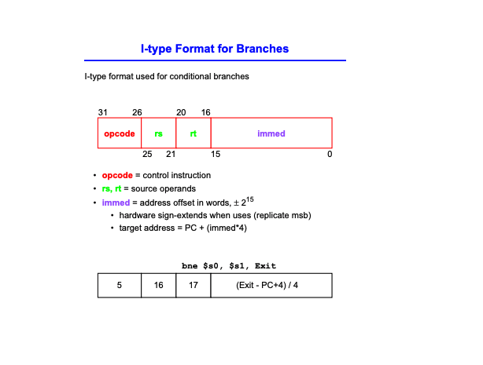

# module 1:

---

## 1.6 (on performance):

#### Notes

> , MIPS stretches the distance of the branch by having PC-relative addressing refer to the number of words to the next instruction instead of the number of bytes. Thus, the 16-bit field can branch four times as far by interpreting the field as a relative word address rather than as a relative byte address.

> This form of branch addressing is called PC-relative addressing. As we shall see in Chapter 4, it is convenient for the hardware to increment the PC early to point to the next instruction. Hence, the MIPS address is actually relative to the address of the following instruction (PC 􏰃 4) as opposed to the current instruction (PC). It is yet another example of making the common case fast, which in this case is addressing nearby instructions.
Like most recent computers, MIPS uses PC-relative addressing for all conditional branches, because the destination of these instructions is likely to be close to the branch. On the other hand, jump-and-link instructions invoke procedures that have no reason to be near the call, so they normally use other forms of addressing. Hence, the MIPS architecture offers long addresses for procedure calls by using the J-type format for both jump and jump-and-link instructions.

#### Additional Notes**

On assembler symbol tables:
> Hence, Assembly Language was created. However, assembly language is not a very complicated language, the hardest thing that it does is to look up symbolic names in a table and return the associated number. This table is called the Symbol Table. It is used so that programmers refer to memory locations using symbolic names instead of using the actual numeric addresses.

#### Lecture Notes

> Implicit in the stored-program idea is the need to have a register to hold the address of the current instruction being executed. For historical reasons, this register is almost always called the program counter,

PC is the points to the next instruction.

> the book words this confusingly: Implicit in the stored-program idea is the need to have a register to hold the address of the current instruction being executed. For historical reasons, this register is almost always called the program counter.

PC is increment as instructions get executed... that's why it also is listed as the address of the current instruction. But we think about it pointing to the next instruction to be executed... even if it does get incremented halfway through an instruction.

every instruction is 4 bytes, so we add 4 to the program counter so we know that will point to the next instruction.

for bne: pc is 28 and next is -6 for -6 words

mips bucknell converter: https://www.eg.bucknell.edu/~csci320/mips_web/

for disassembler assignment
one dictionary for opcodes, one dictionary for func codes, one dictionary for register (t, s, $zero, no other registers)

This is what a symbol table looks like (from the lecture videos):

The running location total is called the Location Counter. Is the piece that accumulates the addresses as the assembler reads through the program code.

Often symbol tables contain cross references... where the symbol is referenced elsewhere in the program.

What does the assembler do algorithmically?:

Why two passes? Because of the forward refernece problem: symbols are referenced before they are defined. they might be defined in the future/forawrd.

pass 1 of assembler to build symbol table:

#### Formulas

#### Outside notes

> The "add_numbers:" label produces no machine code, it's just bookmark to the address where the first byte of addi instruction is stored in memory, available only to assembler at compile time. So it remembers that bookmark in symbol table and use it to calculate correct machine code for jump/branch instructions targeting it

How are the offsets calculated:

> So offset = (branch destination address – PC – 4)/4

In the above, PC is the PC after the word increment so it's one word ahead of LC.

#### Definitions
- Location Counter: The running location total is called the Location Counter
